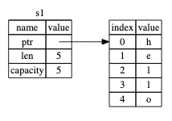
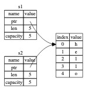
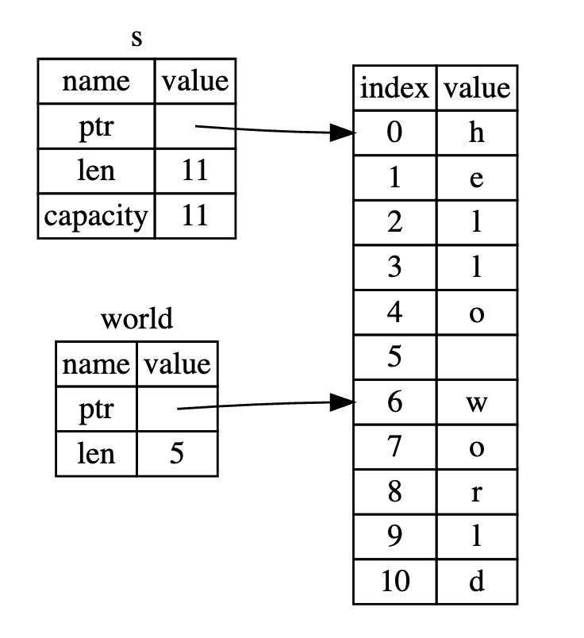

所有权是 Rust 最独特的特性，对该语言的其余部分具有深远的影响。 它使 Rust 能够在不需要垃圾收集器的情况下做出内存安全保证，因此了解所有权的工作原理很重要。 在本章中，我们将讨论所有权以及几个相关的特性：借用、切片以及 Rust 如何在内存中布局数据。

所有权是一组约定的 Rust 程序如何管理内存的规则。像 `Java` 需要有一个垃圾收集器定期的清理内存，`C` 需要明确的分配和释放内存，但是 Rust 是通过所有权系统管理内存的。由编译器检查代码是否符合规则。并且所有权的任何功能都不会在程序运行时减慢程序的速度。

## 所有权规则

- Rust 中的每个值都一个所有人
- 每次只能有一个所有人
- 当所有者超出作用域时，该值将被删除

## 变量作用域

```rust
fn main() {
    {                      // s 还未被声明，不是有效的
        let s = "hello";   // s 从现在开始有效

        // do stuff with s
    }                      // 作用域范围结束，s 不再有效
}
```

- 从变量 `s` 被声明开始，在被声明的作用域内，它是有效的
- `s` 在超出作用域之前一直有效

## String 类型

`String` 类型是在堆上（`heap`）分配的数据，因此字符数量可变。 可以使用 `from` 函数从字符串文字创建一个 `String`，

```rust
let mut s = String::from("hello");

s.push_str(", world!"); // push_str() appends a literal to a String

println!("{}", s); // This will print `hello, world!`
```

当我们调用 `String::from`，会在堆上给新创建的实例分配内存，当绑定这个实例的变量超出作用域，Rust 调用一个特殊的函数 `drop`，内存自动释放。

## Move

在 Rust 中，多个变量可以以不同的方式与相同的数据交互。

```rust
	let x = 5;
	let y = x;
```

`5` 绑定到 `x`，然后复制 `x` 的值绑定到 `y`，所以 `y` 的值也是 `5`。因为整形是固定字节长度的标量类型，所以生成的两个 `5` 都存放在栈（`stack`）。

```rust
	let s1 = String::from("hello");
	let s2 = s1;
```

与上一个例子不同，Rust 不会复制 `s1` 绑定的值然后绑定到 `s2`。一个 `String` 由三部分组成，如下图所示：指向保存 `String` 内容的内存的指针、长度和容量。 这组数据存放在栈中。 右边是堆上保存内容的内存。



`len` 指的是占用多少字节的内存。当使用 `s1` 给 `s2` 赋值，我们复制的是 `s1`，也就是复制栈上的指针、长度和容量，不是复制堆上的值。数据表示如图：



当 `s1` 和 `s2` 超出作用域，Rust 会自动调用 `drop` 函数，这就存在两次释放内存的问题。如果一个变量超出作用域释放了内存，另外一个变量对该内存的访问还会引发内存安全问题。所以为了确保内存安全，在执行 `let s2 = s1` 之后，Rust 认为 `s1` 不再有效。例如，以下代码将不能正常编译：

```rust
fn main() {
    let s1 = String::from("hello");
    let s2 = s1;

    println!("{}, world!", s1);
}
```

以上行为被称为 `move`，可以理解为数据所有权的移动。 在这个例子中，我们会说 `s1` 被移动到 `s2` 中。

## Clone

如果我们想深度复制 `String` 的堆数据而不是栈数据，可以使用方法 `clone`。

```rust
fn main() {
    let s1 = String::from("hello");
    let s2 = s1.clone();

    println!("s1 = {}, s2 = {}", s1, s2);
}
```

## 所有权和函数

将值传递给函数的机制类似于将变量的值赋值给另一个变量的机制。将变量传递给函数将 `move` 或 `clone`，就像赋值一样。下面是一个例子，注解详细解释了每个变量的作用域变化。

```rust
fn main() {
    let s = String::from("hello");  // s 进入作用域

    takes_ownership(s);             // s 的值的所有权移动到函数 takes_ownership
                                    // s 失效了

    let x = 5;                      // x 进入作用域

    makes_copy(x);                  // x 的值的所有权应该移动到函数 makes_copy,
                                    // 但 i32 类型会执行栈复制, 所以 x 依然有效


} // x 超出作用域范围并从栈退出, 然后是 s. 但 s 的值已经移动到其他函数，所以没有内存释放

fn takes_ownership(some_string: String) { // some_string 进入作用域
    println!("{}", some_string);
} // some_string 超出作用域范围 `drop` 被调用，内存被释放

fn makes_copy(some_integer: i32) { // some_integer 进入作用域
    println!("{}", some_integer);
} // some_integer 超出作用域范围从栈退出
```

## 返回值和作用域

返回值也可以转移所有权，注意看下面例子的注释。

```rust
fn main() {
    let s1 = gives_ownership();         // gives_ownership 把发返回值的所有权转移给了 s1

    let s2 = String::from("hello");     // s2 进入作用域

    let s3 = takes_and_gives_back(s2);  // s2 的值的所有权移动到
                                        // takes_and_gives_back
                                        // 它也把返回值的所有权转移给了 s3
} // s3 超出作用域范围并且内存被释放. s2 已经无效
  // s1 超出作用域范围并且内存被释放

fn gives_ownership() -> String {             // gives_ownership 将会转移
                                             // 返回值的所有权给调用它的函数

    let some_string = String::from("yours"); // some_string 进入作用域

    some_string                              // some_string 作为返回值
                                             // 所有权转移出去
}

fn takes_and_gives_back(a_string: String) -> String { // a_string 进入作用域

    a_string  // a_string 作为返回值，所有权转移出去给调用它的函数
}
```

## 引用和借用

被调用的函数获得所有权然后返回每个函数的所有权有时有点多余，如果我们想让一个函数使用一个值但不获取该值的所有权，这种特性称为引用。

```rust
fn main() {
    let s1 = String::from("hello");

    let len = calculate_length(&s1);

    println!("The length of '{}' is {}.", s1, len);
}

fn calculate_length(s: &String) -> usize {
    s.len()
}
```

注意调用函数 `calculate_length` 传入的是 `&s1`，`&` 符号代表引用，它允许你引用某些值而无需值的所有权。因此即使引用不被使用了，`s1` 指向的内存也不会被释放。

函数声明中同样适用 `&` 表明接收的参数是引用。我们将创建引用的动作称为借用。

### 可变引用

```rust
fn main() {
    let mut s = String::from("hello");

    change(&mut s);
}

fn change(some_string: &mut String) {
    some_string.push_str(", world");
}
```

通过声明可变引用 `&mut`，`change` 函数可以改变借用的值。

可变引用有一个很大的限制又称为借用规则，如果你有一个对一个值的可变引用，你就不能有对该值的其他可变或不可变引用。这个特性可以防止数据竞争，数据竞争在满足下面三个条件时发生：

- 两个或多个指针同时访问相同的数据
- 至少有一个指针被用来写入数据
- 没有用于同步访问数据的机制

数据竞争会导致未定义的行为，并且当你试图在运行时跟踪它们时可能难以诊断和修复。Rust 通过拒绝编译带有数据竞争的代码来防止这个问题！

多个不可变引用同时存在是允许的，因为没有任何一个引用可以改变被引用的值。

引用的作用域是从它的声明开始到最后一次使用它结束。弄清楚引用的作用域可以在同一个代码块内写多个引用，而不会触发上述的限制。例如：

```rust
fn main() {
    let mut s = String::from("hello");

    let r1 = &s; // no problem
    let r2 = &s; // no problem
    println!("{} and {}", r1, r2);
    // variables r1 and r2 will not be used after this point

    let r3 = &mut s; // no problem
    println!("{}", r3);
}
```

`r1` 和 `r2` 的作用域在第一个 `println!` 就结束了，与 `r3` 的范围不重叠，所以代码可以通过编译。

### 悬挂引用

有些语言会有悬挂指针问题，比如指针指向的内存已经释放，但是指针还存在。

Rust 的编译器确保引用永远不会成为悬挂引用，即在某个值的引用失效之前，不会发生被引用的值的内存先被释放。

悬挂引用的例子：

```rust
fn main() {
    let reference_to_nothing = dangle();
}

fn dangle() -> &String {
    let s = String::from("hello");

    &s
}
```

`dangle` 函数试图返回 `s` 的引用，但当 `dangle` 函数运行结束，`s` 值的内存会被释放，所以 `&s` 将会指向一个无效的 `String`。所以编译不会通过。

## 切片类型

切片可以引用集合中连续的元素序列，而不是整个集合。切片是一种引用，因此它没有所有权。

### 字符串切片

字符串切片是对字符串的一部分的引用，它看起来像这样：

```rust
fn main() {
    let s = String::from("hello world");

    let hello = &s[0..5];
    let world = &s[6..11];
}
```

我们通过指定 `[starting_index..ending_index]` 使用方括号内的范围创建切片，其中 `starting_index` 是切片中的第一个位置，`ending_index` 是切片中的最后一个位置的后面一个位置。`slice` 数据结构中存储的是切片的起始位置和长度，长度对应的是 `ending_index` 减去 `starting_index`

因此，在 `let world = &s[6..11];` ，`world` 将是一个切片，其中包含一个指向 `s` 的索引 `6` 处长度值为 `5` 的字节的指针。



使用 Rust 的 `[starting_index..ending_index]` 语法，如果你想从索引 `0` 开始，你可以删除 `starting_index`。如果您的切片包含字符串的最后一个字节，则可以删除 `ending_index`。另外，`String` 的完全切片 `s[..]` 和 `String` 的引用 `&s` 是等价的。

表示“字符串切片”的类型，书写为 `&str`。

字符串文字就是字符串切片：

```rust
let s = "Hello, world!";
```

这里 `s` 的类型是 `&str`，它是一个指向二进制文件特定点的切片。

### 其他类型的切片

我们可能想引用数组的一部分。我们会这样做：

```rust
fn main() {
	let a = [1, 2, 3, 4, 5];

	let slice = &a[1..3];

	assert_eq!(slice, &[2, 3]);
}
```

可以理解为更通用的切片类型，此切片的类型为 `&[i32]`。 通过存储对第一个元素的引用和长度，它的工作方式与字符串切片相同。 可以各种其他集合使用这种切片。

## 总结

所有权、借用和切片的概念确保 Rust 程序在编译时的内存安全。 Rust 语言让您可以像其他系统编程语言一样控制内存使用，但是让数据所有者在所有者超出范围时自动清理该数据意味着你不必编写和调试额外的代码。
